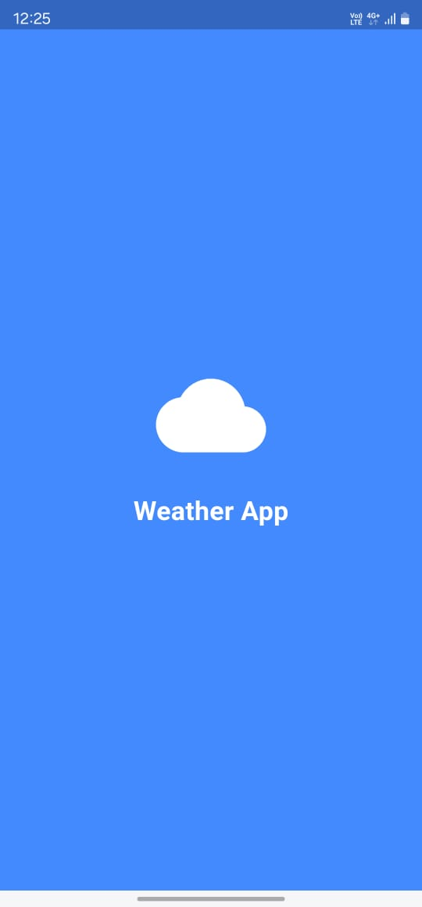
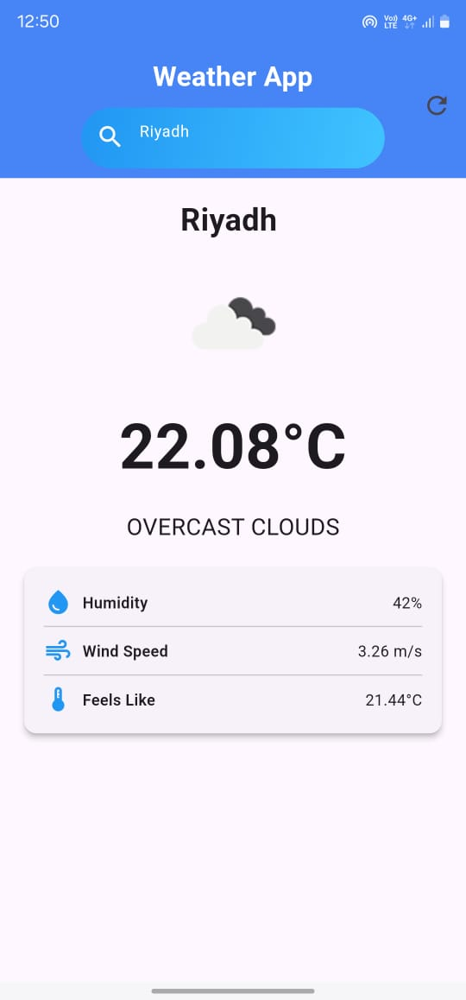

<body>

  <h1>Weather App</h1>
  
This is a Flutter-based Weather App that shows the current weather for a selected city. The app uses the OpenWeatherMap API to fetch real-time weather data and provides features like searching for cities, displaying weather details, and showing animated transitions between screens.

  <h2>Features</h2>
  <ul>
    <li>Search for weather in any city.</li>
    <li>Display weather information: temperature, humidity, wind speed, and more.</li>
    <li>Animations for smooth transitions between screens.</li>
    <li>Shows weather icon and description along with the temperature.</li>
    <li>Splash screen with app logo before transitioning to the main screen.</li>
  </ul>

  <h2>Setup Instructions</h2>
  
To run this app locally, follow these steps:

  <ol>
    <li>Clone the repository:</li>
    <pre><code>git clone https://github.com/fareedtariq16/weather-app.git</code></pre>
    <li>Navigate to the project directory:</li>
    <pre><code>cd weather-app</code></pre>
    <li>Install the dependencies:</li>
    <pre><code>flutter pub get</code></pre>
    <li>Run the app on your device or emulator:</li>
    <pre><code>flutter run</code></pre>
  </ol>

  <h2>App Screenshots</h2>
  
Below are some screenshots of the app:

  
  

    

      <h3>Splash Screen</h3>
      
    

    

      <h3>Home Screen with Weather Info</h3>
      
    

  

  <h2>Dependencies</h2>
  
This app uses the following dependencies:

  <ul>
    <li><b>provider</b>: State management package.</li>
    <li><b>animate_do</b>: For adding animations in the app.</li>
    <li><b>http</b>: For making HTTP requests to fetch weather data.</li>
  </ul>

  <h2>Contributing</h2>
  
If you'd like to contribute to this project, feel free to fork the repository and create a pull request. Please ensure that your changes align with the app's functionality and overall design.

  <h2>License</h2>
  
This project is licensed under the MIT License.

</body>
